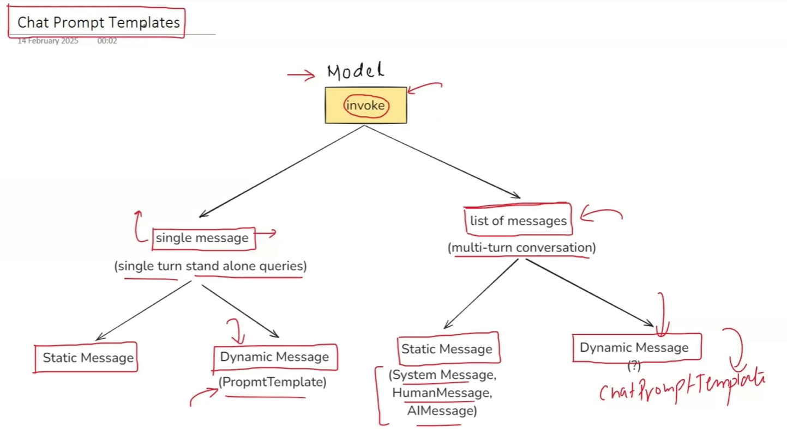

**As we know that 'invoke' method can be used in two ways:**

* we use **PromptTemplate** when dealing with a single message and wants to create a dynamic message.
* but when working with list of messages, we use **ChatPromptTemplate**, to create a dynamic message.

